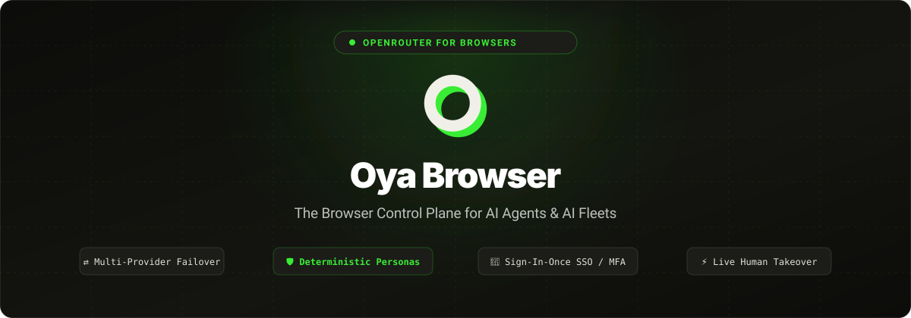
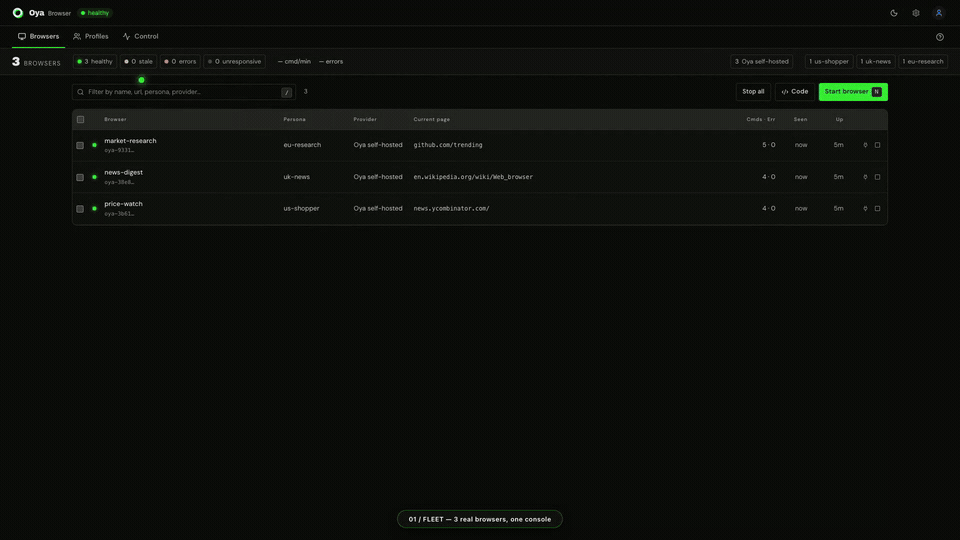
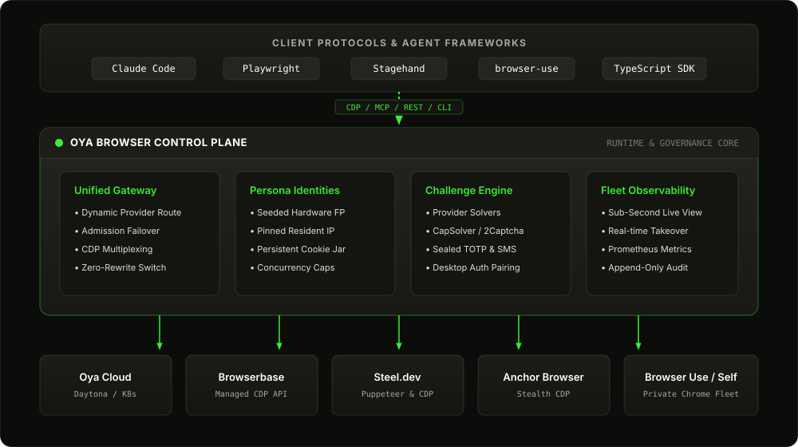
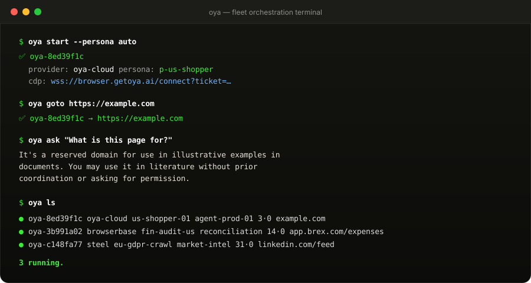
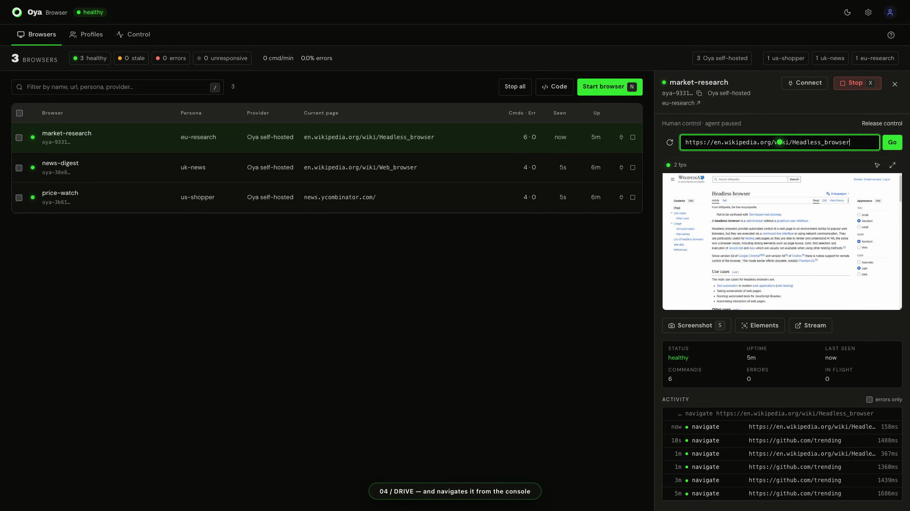

<p align="center">
  
</p>

<h3 align="center">OpenRouter for browsers.</h3>

<p align="center">
  One API over Oya Cloud, Browserbase, Steel, Anchor, Browser Use and your own Chrome.<br>
  Device personas that score 0% headless on CreepJS, CAPTCHA and MFA handling, and a live console where a human can take over.
</p>

<p align="center">
  <a href="#stealth-0-headless-0-lies"></a>
  <a href="#stealth-0-headless-0-lies"></a>
  <a href="#stealth-0-headless-0-lies"></a>
  <br>
  <a href="https://www.npmjs.com/package/@oya-ai/browser"></a>
  <a href="https://www.npmjs.com/package/@oya-ai/cli"></a>
  <a href="LICENSE.md"></a>
  <a href="https://browser.getoya.ai"></a>
</p>

<p align="center">
  <a href="https://browser.getoya.ai">Hosted</a> ·
  <a href="#self-host">Self-host</a> ·
  <a href="https://browser.getoya.ai/docs">Docs</a> ·
  <a href="examples">Examples</a>
</p>

<p align="center">
  
</p>
<p align="center"><sub>Three real browsers on a self-hosted stack: live view, a human takeover, numbered elements, and the hand-back. Nothing mocked (<a href="scripts/record-walkthrough.mjs"><code>scripts/record-walkthrough.mjs</code></a>).</sub></p>

## Quickstart

```bash
npm install @oya-ai/browser
```

```ts
import { Oya } from "@oya-ai/browser";

const oya = new Oya(); // reads OYA_API_KEY

// "auto": the least recently used persona that is under its concurrency cap
await using browser = await oya.browser.start({ persona: "auto", captcha: "auto" });

await browser.goto("https://news.ycombinator.com");
console.log(await browser.ask("What are the top 3 stories?"));
```

`await using` stops the browser when the scope exits. It needs Node 24+ or TypeScript 5.2+ (`tsx` works); otherwise call `browser.stop()` in a `finally`.

Which vendor runs the browser is a setting on your API key. Your agent code stays the same when you switch.

## Give it to your agent

Get a key at [browser.getoya.ai](https://browser.getoya.ai), `export OYA_API_KEY=...`, then pick one:

```bash
# Claude Code: the MCP server and the skill, as one plugin
claude plugin marketplace add OyadotAI/oya-browser
claude plugin install oya-browser@oya

# The skill, for any agent that reads skills (Claude Code, Cursor, Codex, Copilot and more)
npx skills add OyadotAI/oya-browser

# Just the MCP server, in Claude Code
claude mcp add --transport http oya https://browser.getoya.ai/mcp/pool \
  --header "Authorization: Bearer $OYA_API_KEY"
```

For Cursor, Windsurf, Claude Desktop or any other MCP client:

```json
{ "mcpServers": { "oya": { "url": "https://browser.getoya.ai/mcp/pool", "headers": { "Authorization": "Bearer YOUR_API_KEY" } } } }
```

Then ask your agent something like *"Start a browser, open Hacker News and summarize the top 3 stories."* It calls `start_browser`, `navigate`, `analyze_page` and `stop_browser` on its own. Agents that read the web find all of this at [browser.getoya.ai/llms.txt](https://browser.getoya.ai/llms.txt).

## Stealth: 0% headless, 0 lies

Faking a fingerprint is easy. Faking one that CreepJS can't catch lying is the hard part.

[`server/test-stealth.js`](server/test-stealth.js) launches the same headless Chrome twice. The first run is bare. The second applies a persona exactly as production does. Both then face the public detectors. Headless Chrome 153 on macOS, 2026-09-11:

| | Bare headless Chrome | With an Oya persona |
|:---|:---:|:---:|
| **CreepJS headless score** (lower is better) | 100% | **0%** |
| **CreepJS lies detected** | 0 | **0** |
| **CreepJS stealth-tampering score** (lower is better) | 0% | **0%** |
| **Bot.Sannysoft** | 27 / 31 pass | **31 / 31 pass** |
| **Oya probe suite** (weighted) | 55 / 64 | **64 / 64** |
| CreepJS like-headless score (lower is better) | 38% | 31% |

Every value Oya changes survives CreepJS's lie battery, and zero lies means it caught none. That covers the checks it runs from a second realm and the ones it runs from a service worker. Most stealth layers fail there. Here's why this one holds up:

- **Native first.** Chrome emulates the webdriver flag, platform, core count, locale, timezone and screen itself, over CDP. There's no patched value to catch.
- **Native-shaped patches.** Whatever emulation can't reach is patched to look native from every realm: not constructible, no `prototype`, `[native code]` in every frame, and "Illegal invocation" when read off the prototype. That includes the phantom iframe CreepJS runs its lie tests from.
- **Workers and iframes too.** The persona reaches dedicated, shared and service workers and cross-site iframes, where CAPTCHA and Turnstile widgets live. Each one is held paused until it's covered, so the page and its workers report the same machine.

Of the remaining like-headless signals, two are headless-only rendering defaults (system colors and a light color scheme). The other three are Android-only APIs that real desktop Chrome lacks as well. Don't take our word for any of it:

```bash
oya stealth-test --live    # from a checkout, or: node server/test-stealth.js --live
```

## Why

Every cloud-browser vendor has its own API, its own session model and its own outages. If you couple your agents to one, you inherit all three. Oya sits between your agents and the vendors, the way OpenRouter sits between apps and LLM providers:

- **One integration.** CDP, MCP, SDK and CLI all work the same way whichever vendor runs the browser.
- **Failover at connect.** The `/connect` gateway tries your routes in priority order. A failed vendor handshake releases that allocation and moves on to the next route.
- **An identity that lasts.** A persona binds a fingerprint, a cookie jar and a proxy for life, so a site sees the same device every time.
- **Stealth you can verify.** The scores above come from a script you run yourself, not from a marketing page.
- **A human on call.** When a challenge beats automation, an operator takes over in the live view and hands control back.

<p align="center">
  
</p>

| | One vendor, directly | Through Oya |
|:---|:---|:---|
| **Switching vendors** | Rewrite against a new API | Change a setting on the key |
| **Vendor outage at connect** | Your agents are down | `/connect` falls through to the next route |
| **Device identity** | Whatever the vendor offers per session | A persona: seeded fingerprint, cookie jar and proxy, stable across runs |
| **Stealth** | The vendor's claims | [0% CreepJS headless, 0 lies, 31/31 Sannysoft](#stealth-0-headless-0-lies), reproducible with `oya stealth-test --live` |
| **Logins** | Scripted login flows | Sign in once in the desktop app; remote personas inherit the cookies |
| **CAPTCHA and MFA** | Vendor-specific, or build it yourself | The vendor's native solver where there is one, CapSolver or 2Captcha otherwise, sealed TOTP, live takeover |
| **Fleet operations** | One dashboard per vendor | One console, Prometheus `/metrics`, an audit log, spend per key, stop-all |

## Personas

Anti-bot systems watch device consistency over time. There are two ways to get flagged:

1. **One account, many fingerprints** looks like a bot farm.
2. **One fingerprint, many concurrent sessions** looks like a device farm.

```
persona = fingerprint + cookie jar + proxy    # one device
API key = a fleet of personas
```

A persona's fingerprint is derived from a stored seed, so it's identical on every restart. A persona is never re-rolled. If you need another device of the same kind, clone it:

```ts
import { Oya } from "@oya-ai/browser";

const oya = new Oya();

const persona = await oya.personas.create({
  name: "us-shopper",
  prefs: { platform: "MacIntel", timezone: "America/New_York", locale: "en-US" },
  proxy: { geo: "US" },
  maxConcurrent: 2, // one device shouldn't run 50 sessions at once
});

await using browser = await oya.browser.start({ persona: persona.id });
await browser.goto("https://www.amazon.com");

console.log(persona.fingerprint.platform, persona.fingerprint.timezone); // same next week
```

## Sign in once

Scripted logins break on Google SSO, Okta, passkeys and Cloudflare. Skip them:

1. Open the Oya desktop app (macOS download on [browser.getoya.ai](https://browser.getoya.ai)) and pair it from the dashboard.
2. Sign in to your sites normally: SSO, Okta, a hardware passkey.
3. The session cookies are encrypted (AES-256-GCM) and synced to your persona.
4. Remote browsers for that persona start already signed in, on the same fingerprint.

## CAPTCHA, MFA and human takeover

```ts
import { Oya } from "@oya-ai/browser";

const oya = new Oya();
await using browser = await oya.browser.start();

await browser.goto("https://www.google.com/recaptcha/api2/demo");

// The vendor's native solver where there is one, CapSolver or 2Captcha otherwise
const captcha = await browser.solveCaptcha();
console.log(captcha.solved, captcha.method);

// TOTP generated from a secret sealed on the persona
const mfa = await browser.completeMfa();

// A phone approval or biometric prompt: hand it to a person
if (!mfa.completed && mfa.liveViewUrl) console.log("Needs a human:", mfa.liveViewUrl);
```

- **CAPTCHA:** Oya uses the vendor's native solver on Anchor, Browserbase and Steel, so you aren't billed twice and two solvers never race. Everywhere else it sends the challenge to 2Captcha or CapSolver.
- **TOTP:** Seeds are encrypted with AES-256-GCM at rest and never returned by the API.
- **Takeover:** The live view is a JPEG stream over SSE that takes clicks, drags, scrolls and typing. An operator acquires control, resolves the prompt, releases control, and the agent resumes.

## Bring your own tools

Every browser exposes a `cdpUrl` routed through Oya's gateway:

```ts
import { chromium } from "playwright-core";
import { Oya } from "@oya-ai/browser";

const oya = new Oya();
await using browser = await oya.browser.start({ provider: "browserbase" });

const context = (await chromium.connectOverCDP(browser.cdpUrl!)).contexts()[0];
const page = context.pages()[0] ?? (await context.newPage());

await page.goto("https://github.com/trending");
console.log(await page.title());
```

- **Over CDP:** Playwright, Puppeteer, Stagehand and browser-use (Python).
- **Over MCP:** Claude Code and Cursor, at `/mcp/:id`.

## CLI

<p align="center">
  
</p>

```bash
npm install -g @oya-ai/cli

oya login                       # save an API key
oya init                        # pick a model, browser provider and sign-ins
oya start --persona auto        # start a browser
oya goto https://example.com    # navigate the newest browser
oya ask "Find the pricing tier" # drive it in plain language
oya open                        # watch it in the live view
oya ls                          # what's running
oya rm --all                    # stop everything
```

The full command list is in the [CLI README](packages/cli).

## Console

<p align="center">
  
</p>

- **Health strip:** Healthy, stale, error and unresponsive counts. Click any count to filter the table.
- **Live view:** Watch any browser; take control to drive it.
- **Element tree:** Numbered element IDs (`[data-ac-id]`), so an agent can plan with fewer tokens.
- **Governance:** An audit log, Prometheus `/metrics`, spend per API key, and stop-all (`POST /api/browsers/stop {"all": true}`).

## Self-host

```bash
git clone https://github.com/OyadotAI/oya-browser.git
cd oya-browser
docker compose up
```

Open `http://localhost:3100` for the dashboard. Kubernetes manifests live in [`k8s/`](k8s).

| Variable | Description |
|:---|:---|
| `OYA_PROFILE_SECRET` | Key for encrypting cookies, tokens and TOTP seeds at rest (AES-256-GCM). If you leave it unset, the server generates one into the data volume, so keep that volume. |
| `OYA_OPERATOR_TOKEN` | Bearer token for `/metrics` and fleet drain. |
| `SUPABASE_URL` / `SUPABASE_SERVICE_KEY` | Postgres storage. Without these, state lives in `server/data/`. |
| `DAYTONA_API_KEY` / `DAYTONA_SNAPSHOT` | Cloud sandboxes on Daytona. |
| `OYA_PUBLIC_WS_URL` | Public WebSocket URL that remote sandboxes dial back to. |

## Packages

| Package | Description |
|:---|:---|
| [`@oya-ai/browser`](packages/sdk) | TypeScript SDK. ESM and CJS, typed, no runtime dependencies. |
| [`@oya-ai/cli`](packages/cli) | CLI for the fleet, the live view and stealth tests. |
| [`server`](server) | Control plane: gateway, admission, personas, challenges. |
| [`ui`](ui) | Next.js console, live viewer and docs. |
| [`browser`](browser) | Containerized and Electron desktop runtime. |
| [`examples`](examples) | One runnable script per capability. |

## Tests

```bash
npm test                   # gateway, providers, personas, security, challenges
```

## License

The SDK ([`packages/sdk`](packages/sdk)) and the CLI ([`packages/cli`](packages/cli)) are MIT, so you can embed them in commercial agents. Everything else is source-available under the [Sustainable Use License](LICENSE.md): free for internal business use, research and non-commercial use.
