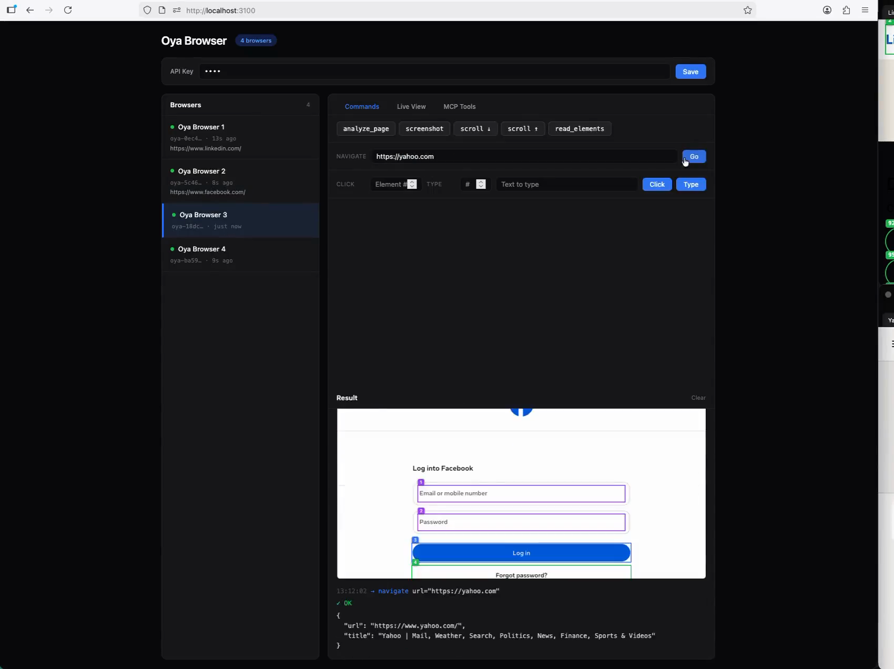
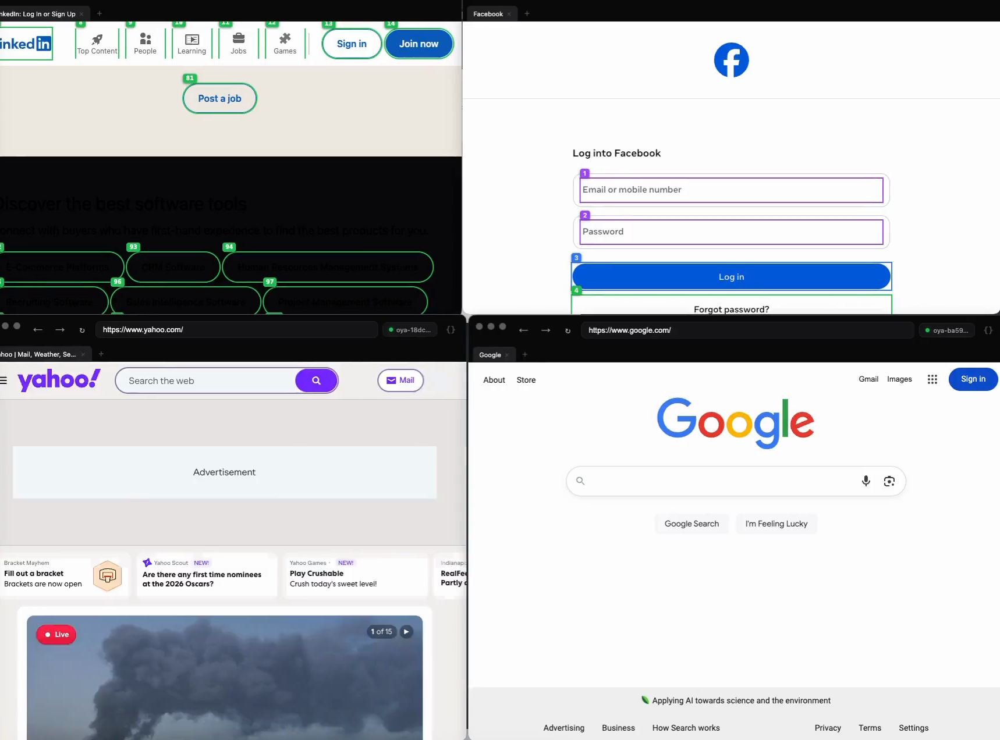

<p align="center">
  
</p>

<h3 align="center">OpenRouter for browsers.</h3>

<p align="center">
  One API over Oya Cloud, Browserbase, Steel, Anchor, Browser Use and your own Chrome.<br>
  Device personas that score 0% headless on CreepJS, CAPTCHA and MFA handling, and a live console where a human can take over.
</p>

<p align="center">
  <a href="#stealth-0-headless-0-lies"></a>
  <a href="#stealth-0-headless-0-lies"></a>
  <a href="#stealth-0-headless-0-lies"></a>
  <br>
  <a href="https://www.npmjs.com/package/@oya-ai/browser"></a>
  <a href="https://www.npmjs.com/package/@oya-ai/cli"></a>
  <a href="LICENSE.md"></a>
  <a href="https://browser.getoya.ai"></a>
</p>

<p align="center">
  <a href="https://browser.getoya.ai">Hosted</a> ·
  <a href="#self-host">Self-host</a> ·
  <a href="https://browser.getoya.ai/docs">Docs</a> ·
  <a href="examples">Examples</a>
</p>

<p align="center">
  
</p>
<p align="center"><sub>Three real browsers on a self-hosted stack: live view, a human takeover, numbered elements, and the hand-back. Nothing mocked (<a href="scripts/record-walkthrough.mjs"><code>scripts/record-walkthrough.mjs</code></a>).</sub></p>

## ⚡ Quick start

```bash
npm install @oya-ai/browser
```

```ts
import { Oya } from "@oya-ai/browser";

const oya = new Oya();                        // reads OYA_API_KEY
await using browser = await oya.browser.start({ persona: "auto", captcha: "auto" });

await browser.goto("https://news.ycombinator.com");
console.log(await browser.ask("What are the top 3 stories?"));
```

Which vendor runs that browser is a setting on your key, not a rewrite. `await using` needs Node 24+ or TypeScript 5.2+ (`tsx` works); otherwise call `browser.stop()` in a `finally`.

The snippets below continue from this one. Runnable versions of all of them are in [`examples/`](examples): CAPTCHA, MFA, personas, five vendors in parallel, Playwright.

## 🧠 Give it to your agent

Get a key at [browser.getoya.ai](https://browser.getoya.ai), `export OYA_API_KEY=...`, then pick one:

```bash
# Claude Code — MCP server and skill, as one plugin
claude plugin marketplace add OyadotAI/oya-browser && claude plugin install oya-browser@oya

# Any agent that reads skills — Claude Code, Cursor, Codex, Copilot
npx skills add OyadotAI/oya-browser

# Just the MCP server
claude mcp add --transport http oya https://browser.getoya.ai/mcp/pool \
  --header "Authorization: Bearer $OYA_API_KEY"
```

Cursor, Windsurf, Claude Desktop or any other MCP client:

```json
{ "mcpServers": { "oya": { "url": "https://browser.getoya.ai/mcp/pool", "headers": { "Authorization": "Bearer YOUR_API_KEY" } } } }
```

Then ask it: *"Start a browser, open Hacker News and summarize the top 3 stories."* It calls `start_browser`, `navigate`, `analyze_page` and `stop_browser` on its own — **15 MCP tools**, all described at [llms.txt](https://browser.getoya.ai/llms.txt).

<a id="stealth-0-headless-0-lies"></a>

## 🕵️ Stealth: 0% headless, 0 lies

> **"Zero detection" is neither measurable nor achievable** — the published leader sits near 77% bypass. This produces a number instead.
>
> — [`server/test-stealth.js`](server/test-stealth.js)

The same headless Chrome, launched twice: once bare, once with a persona applied exactly as production does. Both then face the public detectors. Chrome 153 on macOS, 2026-09-11:

| | Bare headless Chrome | With an Oya persona |
|:---|:---:|:---:|
| **CreepJS headless score** (lower is better) | 100% | **0%** |
| **CreepJS lies detected** | 0 | **0** |
| **CreepJS stealth-tampering score** (lower is better) | 0% | **0%** |
| **Bot.Sannysoft** | 27 / 31 pass | **31 / 31 pass** |
| **Oya probe suite** (29 probes, weighted, 64 points) | 55 / 64 | **64 / 64** |
| CreepJS like-headless score (lower is better) | 38% | 31% |

Zero lies means CreepJS caught none — including the checks it runs from a second realm and from a service worker, where most stealth layers fail. Why it holds:

- 🧩 **Native first.** Chrome emulates the webdriver flag, platform, core count, locale, timezone and screen itself over CDP. There is no patched value to catch.
- 🎭 **Native-shaped patches.** What emulation can't reach is patched to look native from every realm: not constructible, no `prototype`, `[native code]` in every frame, "Illegal invocation" off the prototype — including CreepJS's phantom iframe.
- 🧵 **Workers and iframes too.** Dedicated, shared and service workers plus cross-site iframes, where CAPTCHA widgets live. Each is held paused until covered, so page and workers report one machine.

Of the remaining like-headless signals, two are headless-only rendering defaults; the other three are Android-only APIs real desktop Chrome lacks as well. Don't take our word for it:

```bash
oya stealth-test --live    # from a checkout, or: node server/test-stealth.js --live
```

## 🧬 Personas

Anti-bot systems watch device consistency over time, and there are two ways to fail it:

1. **One account, many fingerprints** looks like a bot farm.
2. **One fingerprint, many concurrent sessions** looks like a device farm.

```
persona = fingerprint + cookie jar + proxy    # one device
API key = a fleet of personas
```

A fingerprint is derived from a stored seed, so it is identical on every restart, and a persona is never re-rolled. Need another device of the same kind? Clone it.

```ts
const persona = await oya.personas.create({
  name: "us-shopper",
  prefs: { platform: "MacIntel", timezone: "America/New_York", locale: "en-US" },
  proxy: { geo: "US" },
  maxConcurrent: 2,                           // one device shouldn't run 50 sessions
});

await using browser = await oya.browser.start({ persona: persona.id });
console.log(persona.fingerprint.platform, persona.fingerprint.timezone);  // same next week
```

## 🙋 When automation hits a wall

Scripted logins break on Google SSO, Okta, passkeys and Cloudflare. Skip them: sign in **once** in the [desktop app](https://browser.getoya.ai), and every remote browser for that persona starts already signed in, on the same fingerprint. Cookies are sealed with AES-256-GCM.

```ts
await browser.goto("https://www.google.com/recaptcha/api2/demo");

const captcha = await browser.solveCaptcha();  // vendor's solver, else CapSolver / 2Captcha
const mfa = await browser.completeMfa();       // TOTP from a seed sealed on the persona

// A phone approval or biometric prompt: hand it to a person
if (!mfa.completed && mfa.liveViewUrl) console.log("Needs a human:", mfa.liveViewUrl);
```

| | How Oya handles it |
|:---|:---|
| 🧩 **CAPTCHA** | The vendor's native solver on Anchor, Browserbase and Steel — so you aren't billed twice and two solvers never race. 2Captcha or CapSolver everywhere else. |
| 🔑 **MFA** | TOTP seeds encrypted at rest with AES-256-GCM, never returned by the API. |
| 🙋 **Takeover** | A JPEG stream over SSE that accepts clicks, drags, scrolls and typing. An operator takes control, clears the prompt, releases, and the agent resumes. |

<p align="center">
  
</p>

## 🔀 Why Oya

Every cloud-browser vendor has its own API, session model and outages — couple your agents to one and you inherit all three.

<p align="center">
  
</p>

| | One vendor, directly | Through Oya |
|:---|:---|:---|
| **Switching vendors** | Rewrite against a new API | Change a setting on the key |
| **Vendor outage at connect** | Your agents are down | `/connect` falls through to the next route |
| **Device identity** | Whatever the vendor offers per session | A persona: seeded fingerprint, cookie jar and proxy, stable across runs |
| **Stealth** | The vendor's claims | [0% CreepJS headless, 0 lies, 31/31 Sannysoft](#stealth-0-headless-0-lies), reproducible with `oya stealth-test --live` |
| **Logins** | Scripted login flows | Sign in once on the desktop; remote personas inherit the cookies |
| **CAPTCHA and MFA** | Vendor-specific, or build it yourself | Native solver where there is one, CapSolver or 2Captcha otherwise, sealed TOTP, live takeover |
| **Fleet operations** | One dashboard per vendor | One console, Prometheus `/metrics`, an audit log, spend per key, stop-all |

**6 backends** — Oya Cloud, Browserbase, Steel, Anchor, Browser Use, your own Chrome — behind **4 surfaces**: CDP, MCP, REST and the SDK.

## 🛠️ Bring your own tools

Every browser exposes a `cdpUrl` routed through Oya's gateway, so Playwright, Puppeteer, Stagehand and browser-use all work unchanged:

```ts
import { chromium } from "playwright-core";

await using browser = await oya.browser.start({ provider: "browserbase" });

const context = (await chromium.connectOverCDP(browser.cdpUrl!)).contexts()[0];
const page = context.pages()[0] ?? (await context.newPage());
await page.goto("https://github.com/trending");
```

## 💻 CLI

<p align="center">
  
</p>

```bash
npm install -g @oya-ai/cli

oya login                        # save an API key
oya start --persona auto         # start a browser
oya goto https://example.com     # navigate the newest one
oya ask "Find the pricing tier"  # drive it in plain language
oya open                         # watch it live
oya ls                           # what's running
oya rm --all                     # stop everything
```

Full command list in the [CLI README](packages/cli).

## 📺 Console

<p align="center">
  
</p>

- 🩺 **Health strip** — healthy, stale, error and unresponsive counts. Click one to filter.
- 👀 **Live view** — watch any browser, or take control and drive it.
- 🔢 **Element tree** — numbered element IDs (`[data-ac-id]`), so an agent plans with fewer tokens.
- 🛡️ **Governance** — audit log, Prometheus `/metrics`, spend per key, and stop-all.

<a id="self-host"></a>

## 🚀 Self-host

```bash
git clone https://github.com/OyadotAI/oya-browser.git
cd oya-browser
make wizard
```

Six questions — where it runs, which database, where browsers run, which LLM, the public URL, optional services. It writes the config, builds the images, brings the stack up and waits for `/readyz` before telling you it worked.

```
◆ Database 2/6
  ❯ SQLite          zero config, one replica
    Supabase        adds email sign-in
    Postgres        many replicas
```

SQLite, Postgres or Supabase. Browsers on Docker, Kubernetes, Oya Cloud, a hosted vendor, or your own Chrome. **Full guide → [docs/self-hosting.md](docs/self-hosting.md)** · operations → [docs/control-plane.md](docs/control-plane.md)

## 📦 Packages

| Package | Description |
|:---|:---|
| [`@oya-ai/browser`](packages/sdk) | TypeScript SDK. ESM and CJS, typed, **zero runtime dependencies**. |
| [`@oya-ai/cli`](packages/cli) | CLI for the fleet, the live view and stealth tests. |
| [`server`](server) | Control plane: gateway, admission, personas, challenges. |
| [`ui`](ui) | Next.js console, live viewer and docs. |
| [`browser`](browser) | Containerized and Electron desktop runtime. |
| [`examples`](examples) | One runnable script per capability. |

## 🧪 Tests

```bash
npm test                 # gateway, providers, personas, security, challenges,
                         # the install wizard, the prompt layer and the k8s fleet
oya stealth-test --live  # the stealth numbers above, on your machine
```

## 📄 License

The SDK ([`packages/sdk`](packages/sdk)) and CLI ([`packages/cli`](packages/cli)) are MIT, so you can embed them in commercial agents. Everything else is source-available under the [Sustainable Use License](LICENSE.md): free for internal business use, research and non-commercial use.
