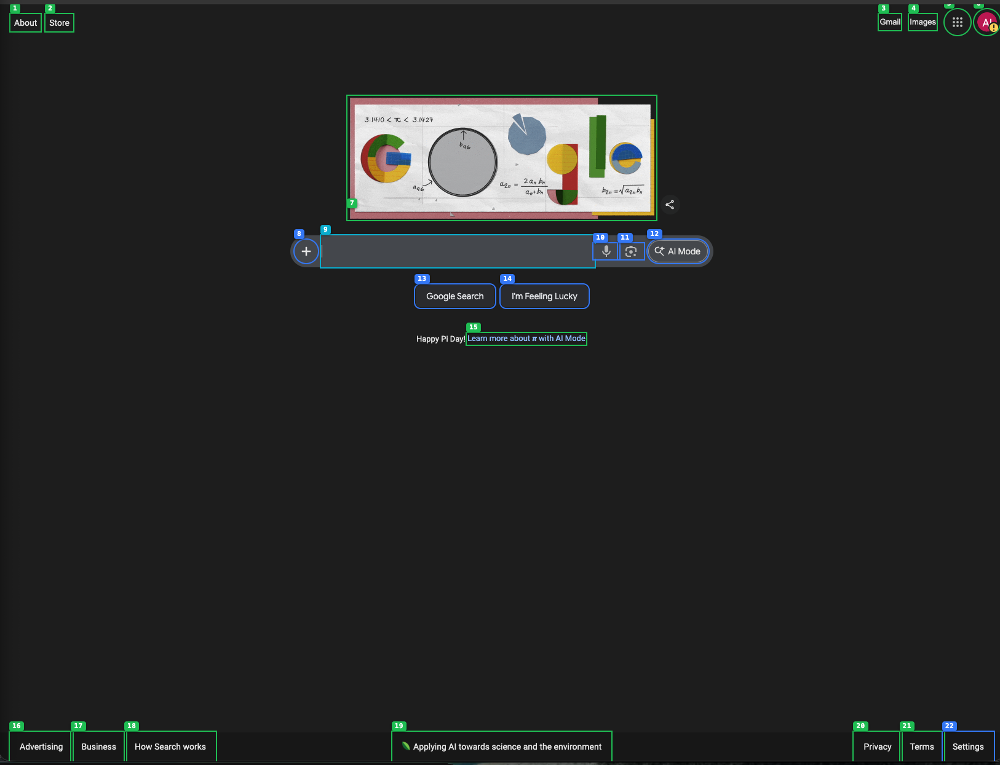
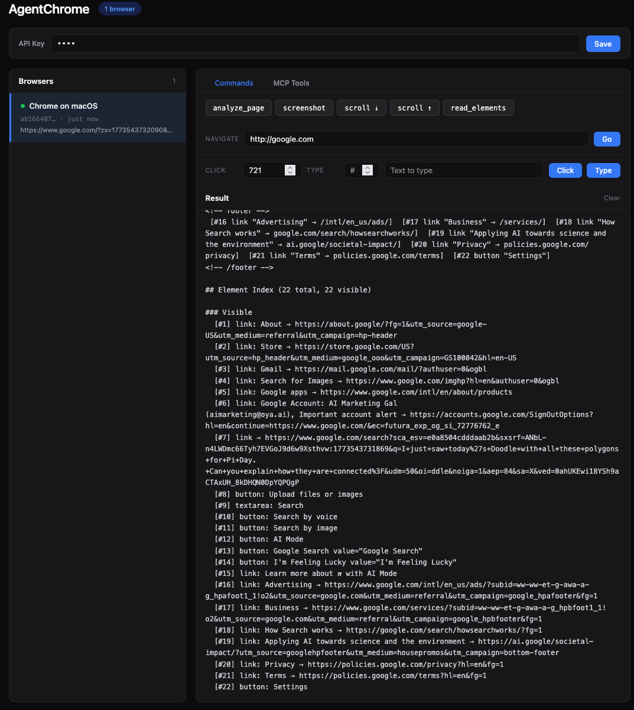

# Oya Browser



Every element on the page gets a number. Want to click "Google Search"? `click(element_id=13)`. Want to type in the search box? `type(element_id=9, text="hello")`. No CSS selectors. No HTML parsing. No pixel coordinates. Just the number.

Turn your real Chrome browser into an MCP server — AI sees the page as numbered markdown, not raw HTML or pixels, and controls it by element ID.

Built to power reliable AI Employees on [Oya.ai](https://oya.ai). Works with Claude Desktop, Cursor, Windsurf, and any MCP client.

## How it works

```
Chrome Extension ──WebSocket──▶ Node.js Server ◀──MCP (Streamable HTTP)── Claude / Cursor / any MCP client
```

1. You browse the web normally in Chrome with the extension installed
2. An AI tool calls `analyze_page` via MCP
3. The extension walks the DOM, highlights every interactive element, assigns each a number
4. Returns structured markdown — the AI reads it like a human would read the page
5. The AI says `click(13)` or `type(9, "hello")` — the extension executes it on the real page

The AI never sees HTML. Never writes CSS selectors. Never parses screenshots. It reads a clean description and refers to elements by number.



## Comparison

| | Oya Browser | Browser-use | Playwright / Puppeteer | Selenium |
|---|---|---|---|---|
| **Real browser** | Yes — your Chrome, your cookies, your logins | No — Playwright underneath | No — spawns new browser | No — spawns new browser |
| **Bot detection** | Invisible — it IS a real browser | Detected — recommends paid proxies to work around it | Detected by Cloudflare, Akamai, etc. | Detected |
| **Existing sessions** | All your cookies, extensions, password manager | None — starts fresh, needs workarounds for auth | None — starts fresh | None |
| **Element interaction** | `click(13)` — numbered by extension on the live DOM | `click 5` — indexed via accessibility tree in a fake browser | `page.click('div.css-1a2b > ...')` — AI writes CSS selectors | Same fragile selectors |
| **What AI reads** | Structured markdown with page content + numbered elements | Element index from accessibility tree | Raw HTML (thousands of lines) | Raw HTML |
| **Page understanding** | Full markdown — headings, text, forms, landmarks, scroll position | Element list only — no page content or structure | None — AI parses HTML soup | None |
| **Token cost** | Low — clean markdown text | Medium — element tree + screenshots | High — raw HTML | High — raw HTML |
| **Protocol** | MCP (standard) — works with Claude Desktop, Cursor, Windsurf, any MCP client | Custom Python API — tied to their SDK | Custom API per library | WebDriver protocol |
| **Memory** | 15KB extension, server is ~30MB | "Chrome can consume a lot of memory" (their FAQ) — full Playwright + Chromium | ~400MB Chromium binary | ~50MB driver + browser |
| **Multiple browsers** | Yes — each gets its own MCP endpoint | One at a time | One per script | One per session |
| **Anonymity** | Built-in — fingerprint sync, proxy routing, WebRTC leak prevention, telemetry blocking | None — recommends paid cloud with stealth browsers | None | None |
| **Fleet fingerprint** | Same API key = identical fingerprint across all instances | Each instance has unique fingerprint | Each instance has unique fingerprint | Each instance has unique fingerprint |
| **CAPTCHAs** | You solve them yourself in your real browser — the agent continues after | Blocks the agent — they sell a cloud service to handle it | Blocks the agent | Blocks the agent |

## Deep dive: why this architecture is fundamentally better

### What browser-use actually does under the hood

Browser-use (80k+ stars) is the most popular tool in this space. We read their entire codebase. Here's what actually happens when you run it:

```python
agent = Agent(
    task="Find the stars of the browser-use repo",
    llm=ChatBrowserUse(),  # their proprietary model ($0.20/M input, $2/M output)
    browser=Browser(),       # spawns Chromium via CDP
)
await agent.run()
```

**On every single step**, their agent:

1. Captures a **full DOM snapshot** via Chrome DevTools Protocol — merging three data sources (accessibility tree + DOM tree + DOMSnapshot with computed styles, bounding boxes, paint order) into a heavy in-memory tree
2. Serializes interactive elements into an **XML tree** capped at 40,000 characters — but this tree only contains interactive elements, **not page content** (no headings, no text, no paragraphs — the AI can click things but doesn't know what the page says)
3. Optionally captures a **screenshot** (base64 PNG)
4. Builds a **single massive message** containing: ~4,000 token system prompt + full agent history (every previous step's thinking, memory, goals, action results) + the 40K char element tree + screenshots + file system state + todo state
5. Sends all of that to the LLM and waits for structured JSON back
6. Parses the response, executes actions, loops

Every 15 steps, a **compaction call** summarizes the history to keep the prompt from blowing the context window. If the LLM returns empty actions, a **retry call** fires. If `extract_content` is used, a **separate LLM call** runs. That's 1-3 LLM calls per step, with massive payloads.

Their system prompt is **~600 lines** teaching the LLM how to navigate, plan, retry, handle errors, manage memory. The agent needs this scaffolding because the browser interaction is so heavy and fragile that the LLM can't just use tools directly — it needs an entire framework around it.

They run **13 watchdogs** in parallel for crash recovery, popup handling, download management, CAPTCHA detection, security warnings. This is how complex it gets when you manage a headless browser.

The install pulls in **ALL LLM SDKs as required dependencies** — OpenAI, Anthropic, Google, Groq, Ollama — even if you only use one. Plus CDP libraries, image processing, telemetry (`posthog`), PDF handling, and more.

When sites detect the bot, they recommend their **paid cloud** with stealth browsers and proxy rotation. When CAPTCHAs appear, their `CaptchaWatchdog` triggers — but it only works with their paid cloud. When you need auth, they suggest syncing your Chrome profile to their cloud or creating temporary accounts.

**The open-source library creates the problems. The paid cloud solves them.**

### What Oya Browser does instead

| | browser-use | Oya Browser |
|---|---|---|
| **Browser** | Spawns fresh Chromium — no cookies, no sessions | Your real Chrome — already logged in everywhere |
| **DOM extraction** | 3-source CDP fusion (AX tree + DOM + DOMSnapshot) per step | Single DOM walk in content script, on demand |
| **What AI sees** | XML tree of interactive elements only (no page content) | Full page as markdown — headings, text, forms, landmarks + numbered elements |
| **Per-step overhead** | ~4K system prompt + full history + 40K element tree + screenshots | One MCP tool call, one markdown response |
| **Agent loop** | Their code calls the LLM, manages history, compaction, retries, planning | No agent loop — the AI client (Claude/Cursor) decides when to call tools |
| **LLM coupling** | Locked into their SDK — `Agent(llm=..., browser=...)` | Standard MCP — any client, any model, no SDK |
| **System prompt** | ~600 lines teaching LLM how to navigate, plan, retry, recover | None — the MCP tool descriptions are self-explanatory |
| **Dependencies** | OpenAI + Anthropic + Google + Groq + Ollama + CDP + PIL + posthog + ... | express + ws + @modelcontextprotocol/sdk + uuid + dotenv |
| **Watchdogs** | 13 parallel watchdogs for crashes, popups, CAPTCHAs, downloads | Zero — browser is stable, user handles popups naturally |
| **Install size** | Hundreds of MB (all LLM SDKs + Chromium) | 15KB extension + ~30MB server |
| **Bot detection** | Detected — sell cloud with stealth browsers | Invisible — it IS a real browser |
| **CAPTCHAs** | Only solvable via paid cloud service | Don't appear — site trusts your browser |
| **Auth** | Hack around with profile sync, temp accounts, cloud | Already authenticated — you're already logged in |

### How clicking actually works (the biggest difference)

In browser-use, when the AI says `click(index=5)`:

1. The agent looks up index 5 in the serialized element tree
2. Maps it back to a CDP `backendNodeId` from the original DOM snapshot
3. Calls `DOM.resolveNode` via CDP to get a remote object reference
4. Calls `DOM.scrollIntoViewIfNeeded` via CDP
5. Calls `DOM.getBoxModel` via CDP to get coordinates
6. Calls `Input.dispatchMouseEvent` via CDP to simulate the click

Six CDP round-trips. If the page changed between analysis and click — DOM mutation, lazy-loaded content, SPA navigation — the `backendNodeId` may be stale and the click fails. The index has no physical presence on the page; it's a number in a serialized tree that has to be resolved back through the protocol.

In Oya Browser, when the AI says `click(element_id=5)`:

1. The extension runs `document.querySelector('[data-ac-id="5"]')` — done

That's it. During `analyze_page`, the extension wrote `data-ac-id="5"` directly onto the HTML element in the live DOM. The number isn't an abstract index in a serialized tree — it's a **real attribute on the real element**. `querySelector` finds it instantly. No CDP. No coordinate calculation. No stale references. The element is tagged on the page itself, like a sticky note.

This is why Oya Browser actions are fast and reliable. There's no translation layer between "the number the AI knows" and "the element on the page." They're the same thing.

### The architectural insight

Browser-use builds a **complex agent loop around the LLM** because browser interaction through CDP is so heavy that the model needs scaffolding — history management, compaction, planning state, retry logic, 13 watchdogs, a 600-line system prompt. The framework does the thinking for the model because the model alone can't handle the raw complexity.

Oya Browser doesn't need any of that. The tools are simple: `analyze_page` returns clean markdown with elements tagged directly on the DOM, `click(13)` runs one querySelector, `type(9, "hello")` types into the element. The MCP tool descriptions are enough. Claude, Cursor, or any MCP client already knows how to call tools, reason about results, and decide next steps. The intelligence is in the AI, not in a wrapper.

browser-use's complexity isn't a feature — it's a consequence of fighting the browser from the outside. When you're inside the browser, the fight disappears.

### The bottom line

```
[#9]  textarea: Search
[#13] button: Google Search
[#14] button: I'm Feeling Lucky
[#3]  link: Gmail → mail.google.com
```

`type(element_id=9, text="Oya Browser")` then `click(element_id=13)`. No agent loop. No 600-line system prompt. No watchdogs. No screenshots. No SDK. No cloud. Just your browser, described clearly, controlled by number.

## Quick Start

### 1. Start the server

```bash
cd server
cp .env.example .env    # edit API_KEYS
npm install
npm start               # listens on port 3100
```

Or with Docker:

```bash
docker compose up -d
```

### 2. Load the extension

1. Open `chrome://extensions`
2. Enable "Developer mode"
3. Click "Load unpacked" → select the `extension/` folder
4. Click the extension icon, enter server URL (`ws://localhost:3100/ws`) and API key
5. Click Connect

### 3. Connect AI tools

Open the dashboard at `http://localhost:3100` — it shows connected browsers, lets you send commands, and gives you copy-paste MCP config for Cursor and Claude Desktop.

Or configure manually:

```json
{
  "mcpServers": {
    "oya-browser": {
      "url": "http://localhost:3100/mcp/BROWSER_ID",
      "transport": "streamable-http",
      "headers": {
        "Authorization": "Bearer YOUR_KEY"
      }
    }
  }
}
```

## Anonymity

### Fleet-wide fingerprint sync

Every browser instance under the same API key automatically shares an identical fingerprint. No configuration needed. The API key deterministically generates every fingerprint value:

- **Canvas** — `toDataURL()` and `toBlob()` produce identical noise patterns
- **WebGL** — Same vendor, renderer, unmasked vendor/renderer strings
- **AudioContext** — Identical processing noise in `OfflineAudioContext`
- **Screen** — Same resolution, devicePixelRatio, availWidth/Height
- **Navigator** — Same platform, hardwareConcurrency, deviceMemory, languages
- **Fonts** — Same detected font set (platform-coherent)
- **ClientRects** — Same `getBoundingClientRect()` noise
- **Timezone & locale** — Matching timezone, locale, Sec-CH-UA headers

10 browsers on 10 machines with the same API key = one identity. Sites like LinkedIn and Cloudflare that fingerprint visitors see a single consistent user across your entire fleet.

Different API key = different fingerprint. Rotate identities by switching keys.

Anti-detect browsers like Multilogin, GoLogin, and AdsPower charge $99+/month for profile-based fingerprint management. Oya does it automatically from your API key — zero configuration, zero extra cost.

### What's included

- **Fingerprint sync** — All browsers under the same API key share byte-identical fingerprints. Canvas, WebGL, AudioContext, font enumeration, ClientRects, screen resolution, hardware specs — all deterministically generated from your API key. No manual profile creation needed.
- **Fingerprint rotation** — Need a different identity? Different API key = different fingerprint. Or create custom profiles with `create_profile` for manual control. Each profile gets a coherent fingerprint (e.g., Win32 platform → Windows GPU strings, Windows fonts, matching screen resolution).
- **Anti-detection stealth** — `navigator.webdriver` removed, Electron markers stripped, `window.chrome` fixed to match real Chrome, `navigator.plugins` populated, permissions API patched. Passes bot.sannysoft.com checks.
- **Proxy support** — SOCKS5 and HTTP/HTTPS per profile. Proxy authentication, DNS leak prevention, and automatic timezone/locale matching via CDP Emulation.
- **WebRTC leak prevention** — ICE candidates stripped to prevent local IP exposure through STUN requests.
- **Telemetry blocked** — Google Safe Browsing, analytics, autofill, component updates blocked at the Chromium flag level.
- **Profile isolation** — Each profile gets its own Electron session partition — separate cookies, localStorage, cache. Switch identities without cross-contamination.

### MCP tools for profiles

```
# Fingerprint is automatic — just connect with your API key and all browsers
# in the fleet share the same identity. But you can also create custom profiles:

create_profile(platform="Win32", timezone="America/New_York", proxy_host="1.2.3.4", proxy_port=1080, proxy_type="socks5")
→ Created profile profile-a1b2c3 (Win32, tz: America/New_York)

set_profile(profile_id="profile-a1b2c3")
→ Switched to profile profile-a1b2c3. All tabs reloaded with new identity.

list_profiles()
→ 3 profiles — profile-a1b2c3 (active), profile-d4e5f6, profile-g7h8i9
```

## MCP Tools

| Tool | Description |
|------|-------------|
| `analyze_page` | Full page as structured markdown with every interactive element numbered `[#id type "label"]`. Includes viewport size, scroll position, visibility flags, form state |
| `navigate` | Navigate to a URL |
| `click` | Click element by number (from analyze) |
| `type` | Type text into input by number — clears first, types character-by-character with realistic events |
| `press_key` | Press keyboard keys and shortcuts |
| `screenshot` | Capture visible tab as PNG |
| `scroll` | Scroll up/down by pixel amount |
| `open_tab` | Open a new browser tab |
| `switch_tab` | Switch between open tabs |
| `list_tabs` | List all open tabs |
| `close_tab` | Close a tab |
| `wait` | Wait for a CSS selector to appear |
| `list_profiles` | List available anonymity profiles with platform, timezone, proxy status |
| `create_profile` | Create a new profile with randomized fingerprint, optional proxy and timezone |
| `set_profile` | Switch to a profile — reloads all tabs with new fingerprint, proxy, and cookie store |

## Dev Panel

The built-in dev panel (`{}` button in the toolbar) has four tabs:

### Chat
Natural language browser control. Type "go to google and search for cats" and the AI navigates, types, clicks, and reports back. Uses the same agentic loop as the web dashboard — analyze → reason → act → repeat.

- Message bubbles with formatted markdown (bold, code, lists, headings)
- Tool call badges showing which MCP tools the AI used
- Copy button on hover for any response
- Conversation history preserved across messages
- Automatic context trimming when conversations get long

Requires an OpenAI API key configured on the server (`OPENAI_API_KEY` env var or dashboard settings).

### Actions
Quick-fire buttons and input fields for every browser command — no AI needed:

- **Page**: Analyze, Screenshot, Reload, Scroll Down/Up
- **Navigate**: URL input → Go
- **Click/Type/Hover**: Element # from analyze → execute
- **Press Key**: Enter, Escape, Tab, ArrowDown, etc.
- **Click Coordinates**: X, Y pixel input
- **Wait**: CSS selector → wait up to 10s
- **Tabs**: List Tabs, New Tab

Results display inline with screenshots rendered as images.

### Network
Live view of all WebSocket traffic between the browser and server:

- Timestamped entries with IN/OUT direction badges
- Click to expand full JSON payload
- Filter by: All, In, Out, Commands, Results

### Source
View the page as the AI sees it:

- **Markdown** tab — the `analyzePage()` output (structured markdown with numbered elements)
- **HTML** tab — raw `document.documentElement.outerHTML`
- Refresh button to fetch on demand

## What analyze_page returns

```
---
url: https://github.com/settings/profile
title: Your Profile
viewport: 1440x900
scroll: 0% (0px / 2400px)
elements: 34 total, 18 visible
---

<!-- main -->
# Public profile

Name: [#1 input:text value="mk"]
Bio: [#2 textarea placeholder="Tell us about yourself"]
URL: [#3 input:url placeholder="https://example.com"]

[#4 button "Update profile"]
<!-- /main -->

## Element Index (34 total, 18 visible)

### Visible
  [#1] input: Name value="mk"
  [#2] textarea: Bio
  [#3] input: URL
  [#4] button: Update profile

### Off-screen (scroll to reveal)
  [#18] link: Delete account → /settings/admin
  ...
```

The AI gets structured content it can reason about, numbered elements it can act on, visibility flags so it knows what needs scrolling, form state (checked, disabled, required), and landmark regions (nav, main, footer) for page structure.

## Architecture

```
┌─────────────────┐         ┌──────────────────┐         ┌──────────────┐
│  Chrome Browser  │◄──WS──►│   Node.js Server  │◄──MCP──►│  Claude/AI   │
│  (extension)     │        │                    │         │  (MCP client)│
│                  │        │  /ws        - WS   │         │              │
│  analyzer.js     │        │  /mcp/:id   - MCP  │         │              │
│  agent.js        │        │  /browsers  - REST │         │              │
│  service-worker  │        │  /          - UI   │         │              │
└─────────────────┘         └──────────────────┘         └──────────────┘
```

- **Extension / Desktop App**: Reads DOM, clicks elements, types text, captures screenshots. Connects to server via WebSocket. Desktop app includes built-in anonymity engine (fingerprint spoofing, proxy routing, profile management)
- **Server**: Express + ws + MCP SDK. Manages browser connections, translates MCP tool calls into WebSocket commands. Each browser gets a dedicated MCP endpoint at `/mcp/:browserId`
- **Dashboard**: Built-in web UI at `/` for testing commands, copying MCP config snippets, and managing anonymity profiles

## License

MIT
